## Отчёт по отладке приложения Пивоева Никиты Михайловича

### Использование `LLM`.

Я воспользовался `Deepseek` до первого запуска проекта, чтобы получить краткое представление о стеке технологий проекта, в частности `fastapi`, поскольку раньше не работал с данным фреймворком (только с `django`).

Также когда искал последние неявные баги в проекте (в частности №6 и №8) и находил участки кода, в которых по ощущениям что-то не так, обращался к `LLM`, чтобы убедиться, что в коде действительно баг.

### Шаг 0: изучение структуры проекта.

* Что сделал: до начала работы зашёл в `requirements.txt`, прочитал несколько статей на `habr` о `fastapi` и сопутствующих технологий; просмотрел структуру проекта.

#### Исправление бага №1.

* Описание проблемы: для более старых версий `python` указана некорректная версия `fastapi`;
* Решение: заменил на последнюю актуальную версию для `python` < 3.8;
* Файл и строка: `requirements.txt:10`;
* Код до:

```
fastapi==999.0.0; python_version < "3.8"
```

* Код после: 

```
fastapi==0.124.4; python_version < "3.8"
```

### Шаг 1: анализ и запуск.

* Что сделал: запустил `docker compose up --build`;
* Проблема: контейнер приложения упал во время инициализации `alembic`.

#### Исправление бага №2.

* Описание проблемы: контейнер приложение падает при запуске команды `alembic upgrade head`;
* Решение: по логам ошибка была в файле `core/config.py`, поле `validation_alias` для `database_url` содержало опечатку, также поправил значение по-умолчанию;
* Файл и строка: `app/core/config.py:14`
* Код до:

```
database_url: str = Field(
    "postgresql+asyncpg://postgres:postgres@db:5432/postgres_typo",
    validation_alias="DATABSE_URL",
)
```

* Код после: 

```
database_url: str = Field(
    "postgresql+asyncpg://postgres:postgres@db:5432/postgres",
    validation_alias="DATABASE_URL",
)
```

* Консольный вывод ошибки:

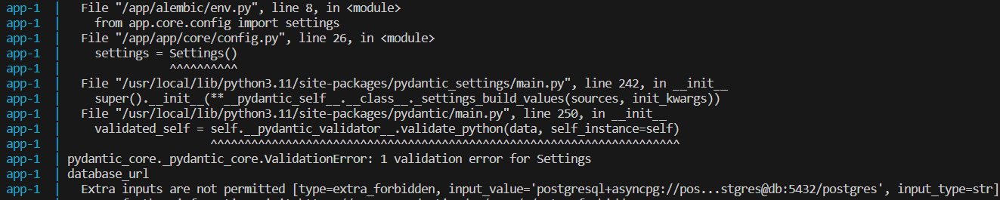

### Шаг 2: повторный запуск.

* Что сделал: запустил `docker compose up --build`;
* Проблема: парсинг вакансий падает с ошибкой;

#### Исправление бага №3.

* Описание проблемы: парсинг вакансий не работает, выдаёт ошибку при обработке имени города, когда город не задан (`null`);
* Решение: не обращаться к `item.city.name`, если `item.city` не задан, то `item.city.name` тоже должен быть не задан;
* Файл и строка: `app/services/parser.py:43`
* Код до:

```
"city_name": item.city.name.strip(),
```

* Код после: 

```
"city_name": None if item.city is None else item.city.name.strip(),
```

* Консольный вывод ошибки:

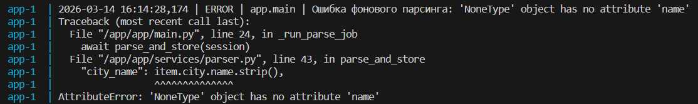

### Шаг 3: запуск после фикса парсера.

* Что сделал: запустил `docker compose up --build`, контейнеры работают без ошибок;
* Проблема: вывод контейнера забивается из-за неправильно настроенного таймера у фонового парсинга;

#### Исправление бага №4.

* Описание проблемы: вакансии парсятся планировщиком с неправильным интервалом, 5 минут вместо 5 секунд;
* Решение: изменить в настройках планировщика время интервала;
* Файл и строка: `app/services/scheduler.py:13`;
* Код до:

```
seconds=settings.parse_schedule_minutes,
```

* Код после: 

```
minutes=settings.parse_schedule_minutes,
```

* Консольный вывод ошибки:

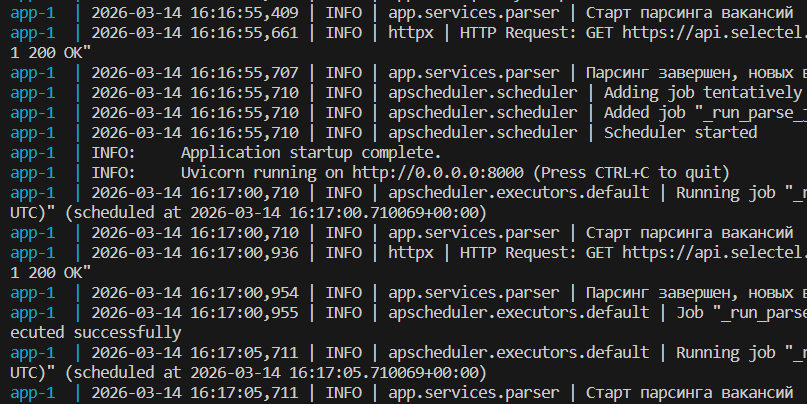

### Шаг 4: исправление оставшихся найденных багов.

#### Исправление бага №5.

* Описание проблемы: эндпоинт `POST /api/v1/vacancies/` для создания вакансий при совпадающих внешних `id` выдаёт код возврата 200, хотя запрос не обрабатывается корректно;
* Решение: код был заменён на 409 (конфликт);
* Файл и строка: `app/api/v1/vacancies:53`;
* Код до:

```
status_code=status.HTTP_200_OK,
```

* Код после: 

```
status_code=status.HTTP_409_CONFLICT,
```

#### Исправление бага №6.

* Описание проблемы: в парсере вакансий создаваемая сессия клиента не закрывается;
* Решение: заменить на обёртку или закрыть соединение после выполнения;
* Файл и строка: `app/services/parser.py:31`;
* Код до:

```
client = httpx.AsyncClient(timeout=timeout)
```

* Код после: 

```
async with httpx.AsyncClient(timeout=timeout) as client:
```

* Альтернативно:

```
client = httpx.AsyncClient(timeout=timeout)
...
await client.aclose()
```


#### Исправление бага №7.

* Описание проблемы: в функции обновления существующих вакансий для хранения `external_ids` используется словарь вместо множества;
* Решение: заменил словарь на множество по аналогии с кодом выше, чтобы `id` были уникальные;
* Файл и строка: `app/crud/vacancy.py:72`;
* Код до:

```
    existing_ids = set(existing_result.scalars().all())
else:
    existing_ids = {}
```

* Код после: 

```
    existing_ids = set(existing_result.scalars().all())
else:
    existing_ids = set()
```

#### Исправление бага №8.

* Описание проблемы: для работы конфигурации в `settings` использовались поля по умолчанию для логов и времени таймера, а не подтягивались из `.env`. Ошибку сложно заметить, поскольку вывод логов генерируется через `docker-compose`, в котором импорт `.env` настроен и работает корректно;
* Решение: настроить параметры по аналогии с `database_url`;
* Файл и строка: `app/core/config.py:16`;
* Код до:

```
log_level: str = "INFO"
parse_schedule_minutes: int = 5
```

* Код после: 

```
log_level: str = Field(
    "INFO",
    validation_alias="LOG_LEVEL",
)
parse_schedule_minutes: int = Field(
    5,
    validation_alias="PARSE_SCHEDULE_MINUTES",
)
```

### Остальные правки.

* Описание проблемы: в сервисе парсинга не используются часть импортируемых объектов;
* Решение: добавил пометки для линтеров, но можно и убрать лишние импорты;
* Файл и строка: `app/services/parser.py:2,7`;
* Код до:

```
from typing import List
from app.core.config import settings
```

* Код после: 

```
from typing import List # noqa: F401
from app.core.config import settings # noqa: F401
```

### Итог.

* Оба контейнера запускаются без ошибок и работают стабильно;
* Фоновый и ручной парсинг работают без падений, данные сохраняются в БД;
* Фоновый парсинг работает по заявленному расписанию (5 минут);
* Все эндпоинты работают корректно;
* Приложение возвращает корректные HTTP-статусы и данные.

### Скриншоты Swagger UI.

`GET /api/v1/vacancies/`:

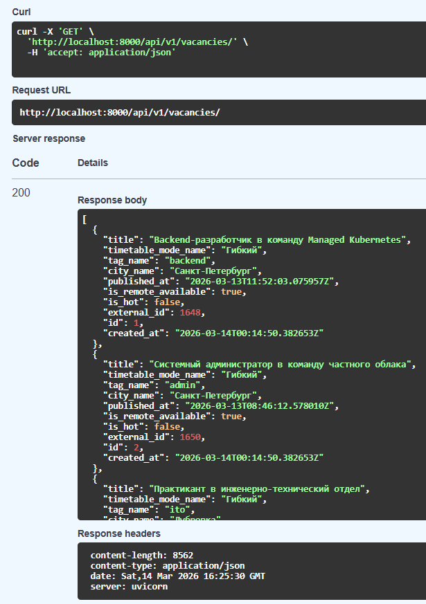

`POST /api/v1/vacancies/`:

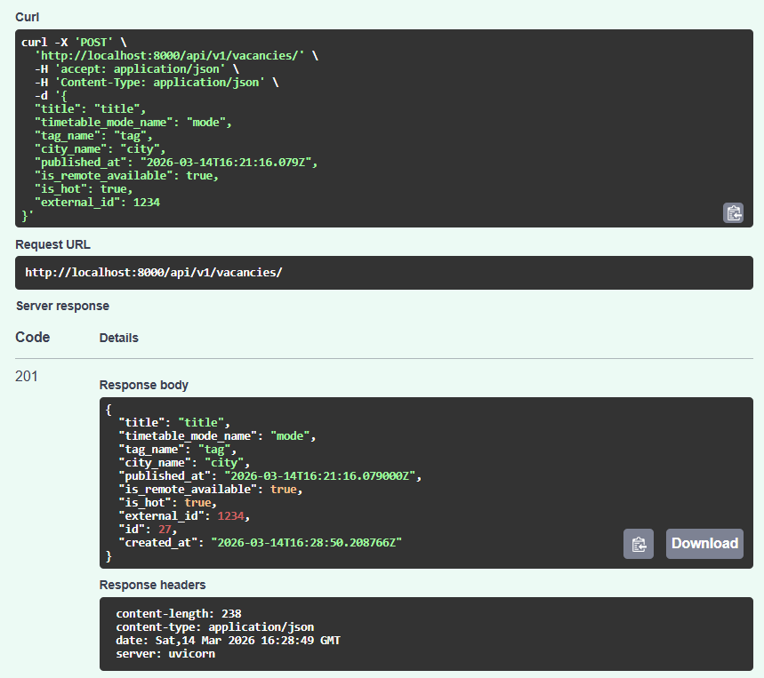

`GET /api/v1/vacancies/{vacancy_id}/`:

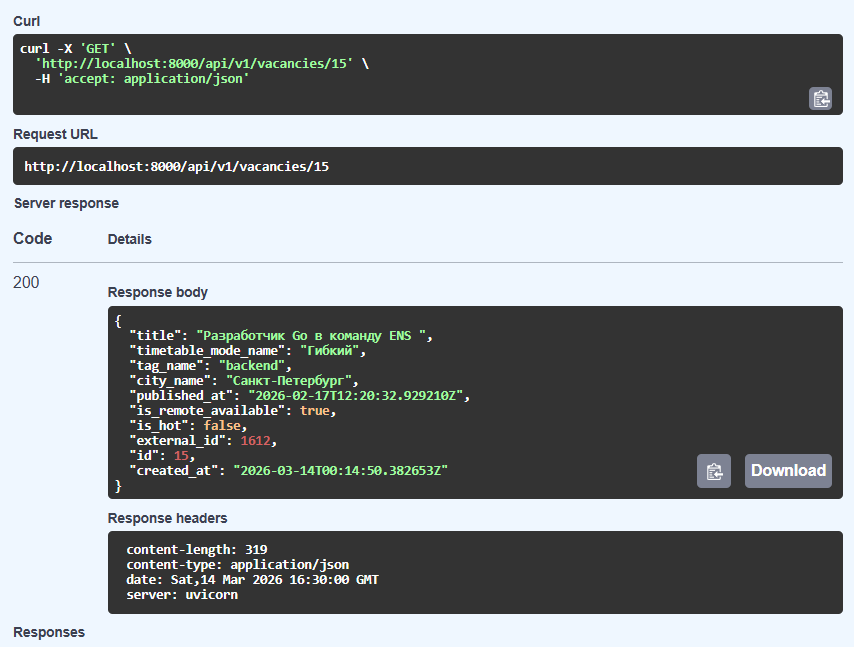

`PUT /api/v1/vacancies/{vacancy_id}/`:

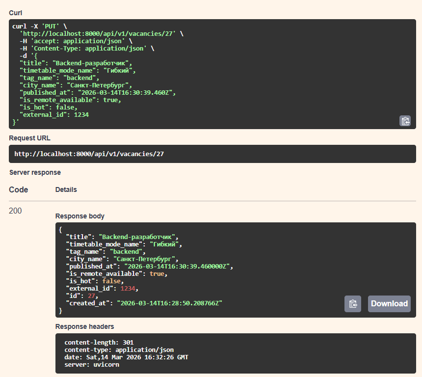

`GET /api/v1/vacancies/{vacancy_id}/`:

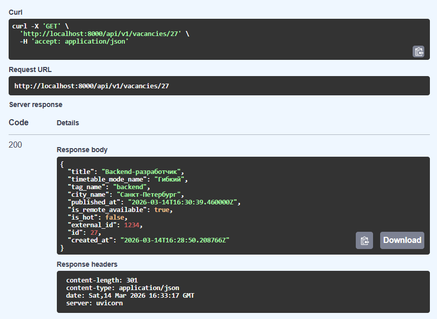

`DELETE /api/v1/vacancies/{vacancy_id}/`:

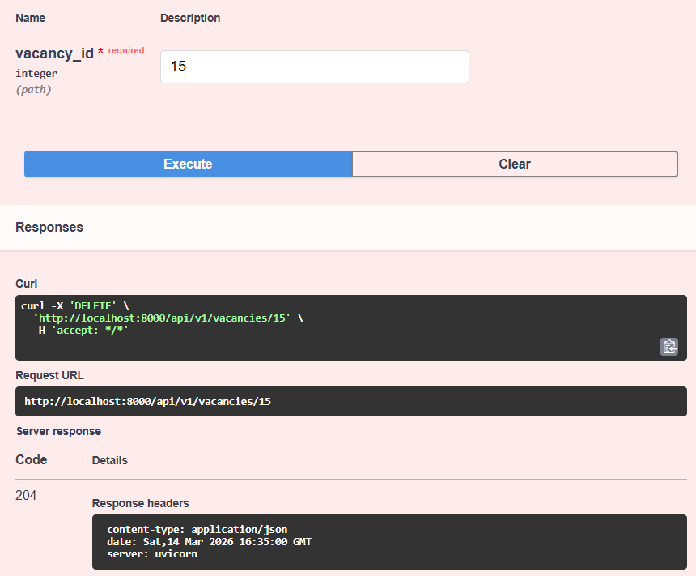

`POST /api/v1/parse/`:

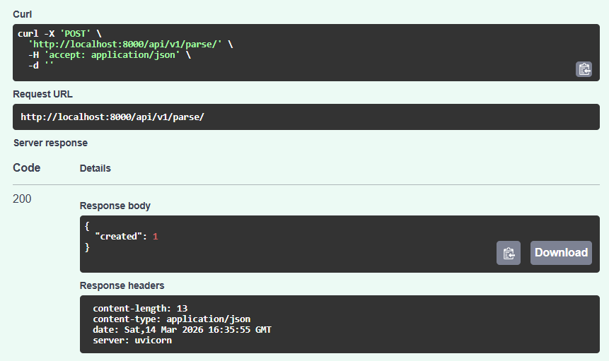

`POST /api/v1/parse/` консольный вывод:

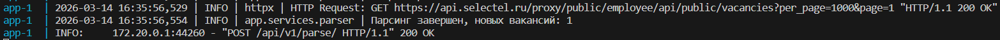
